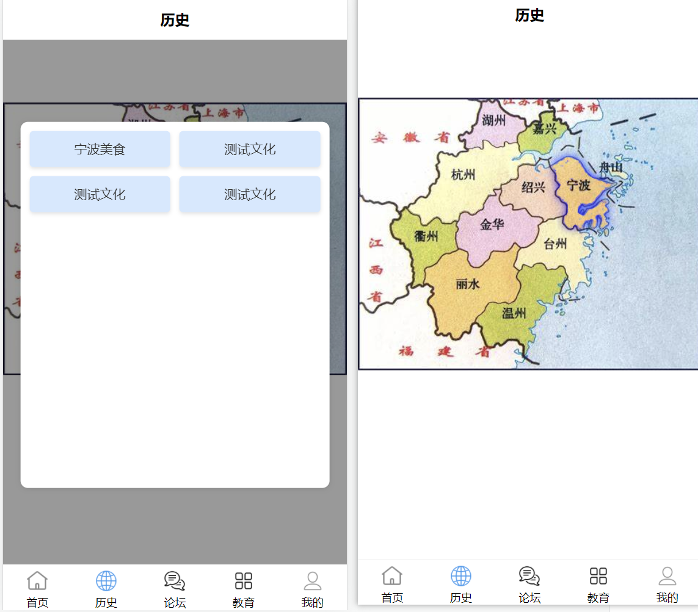
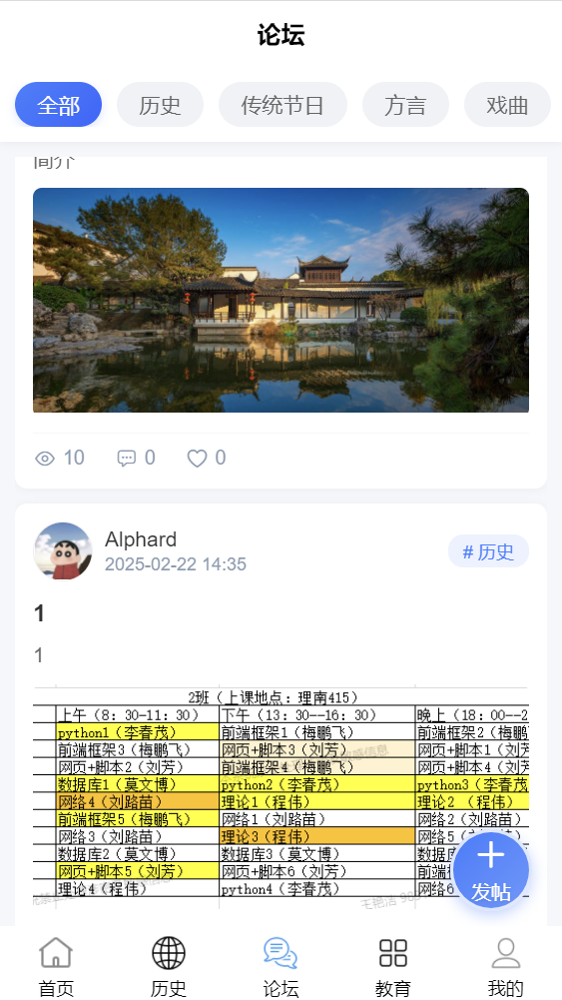
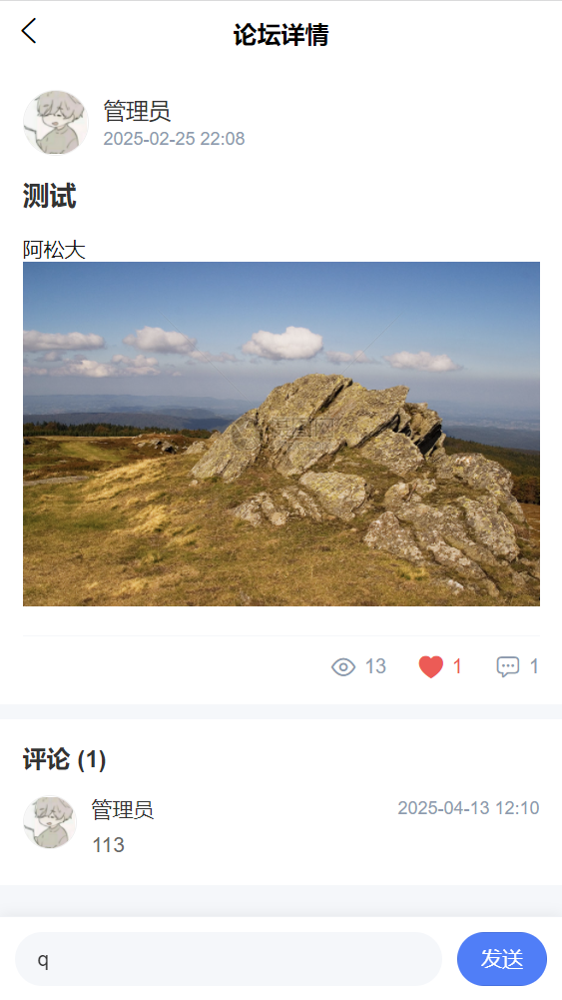
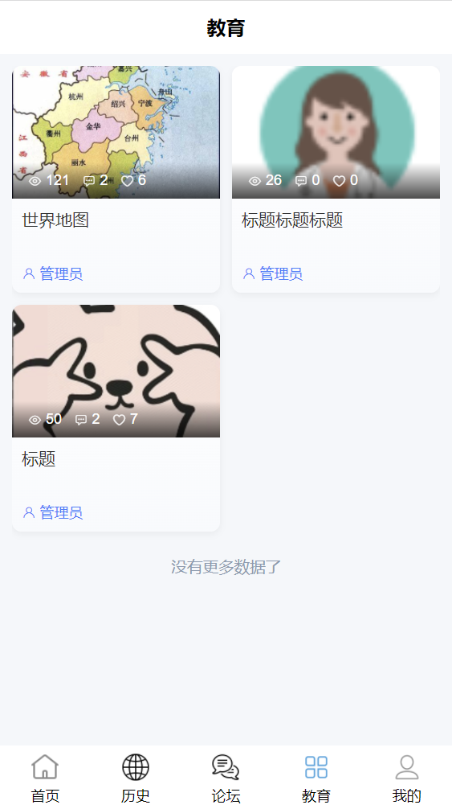
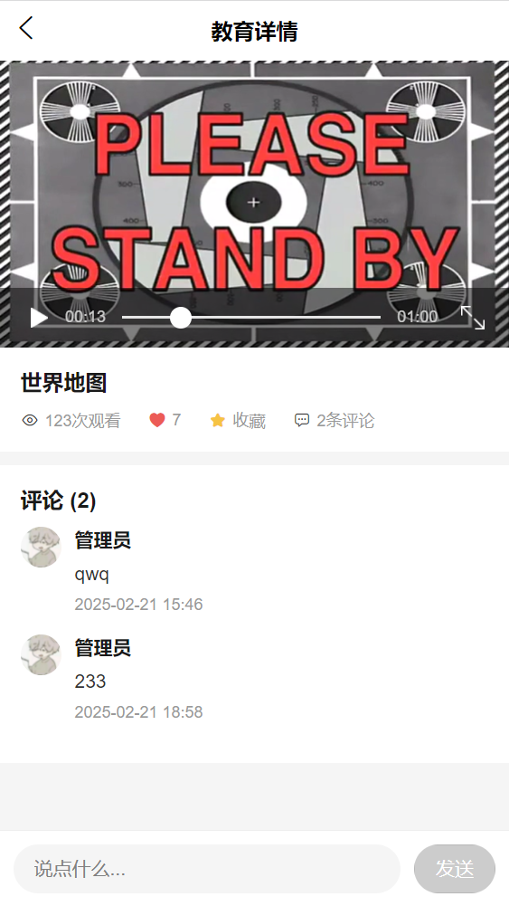
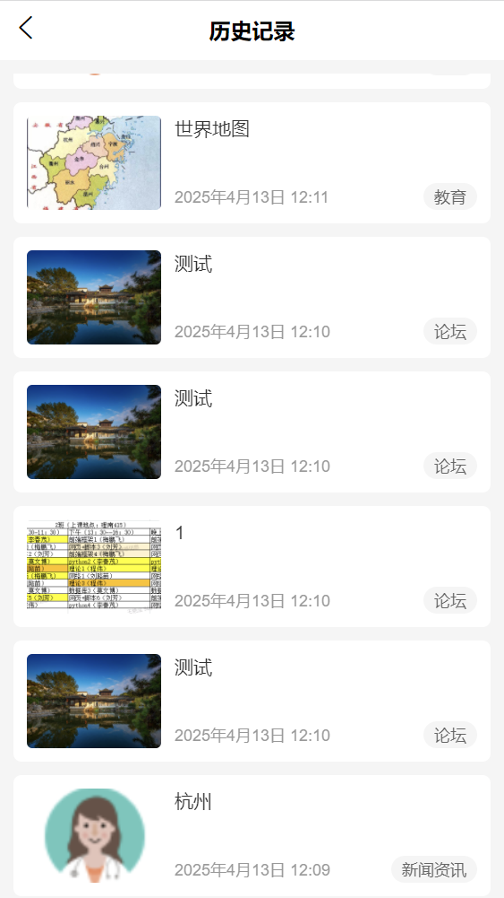

# CTWHB 项目

<div align="center">
<h1>CTWHB 企业级文化介绍应用系统</h1>
</div>

<div align="center">
一个现代化的文化介绍企业级应用系统，采用前后端分离架构
</div>

## 📚 项目介绍

CTWHB 是一个完整的企业级文化介绍应用系统，采用现代化的技术栈和架构设计。项目分为前端、后端和移动端三个主要部分，提供完整的企业级文化展示和管理解决方案。

## 📋 项目结构

项目包含以下主要模块：

### 1. ctwhbWeb（前端项目）

基于现代前端技术栈构建的 Web 应用界面。

```
ctwhbWeb/
├── public/                // 静态资源目录
├── src/                  // 源代码目录
│   ├── assets/          // 资源文件
│   ├── components/      // 公共组件
│   ├── pages/          // 页面组件
│   ├── services/       // API 服务
│   └── utils/          // 工具函数
├── types/              // TypeScript 类型定义
├── .vscode/           // VSCode 配置
├── build/             // 构建输出目录
├── dist/              // 生产环境构建目录
├── .image/            // 图片资源
├── .env               // 环境配置文件
├── .env.local         // 本地环境配置
├── .env.dev           // 开发环境配置
├── .env.prod          // 生产环境配置
├── .env.stage         // 预发布环境配置
├── .env.test          // 测试环境配置
├── .eslintrc.js       // ESLint 配置
├── .prettierrc.js     // Prettier 配置
├── .stylelintrc.js    // StyleLint 配置
├── tsconfig.json      // TypeScript 配置
├── vite.config.ts     // Vite 配置
└── package.json       // 项目依赖配置
```

### 2. ctwhbBoot（后端项目）

基于 Spring Boot 的后端服务。

```
ctwhbBoot/
├── yudao-server/           // 主服务模块
├── yudao-module-system/    // 系统管理模块
├── yudao-module-infra/     // 基础设施模块
├── yudao-framework/        // 框架核心模块
├── yudao-dependencies/     // 依赖管理模块
├── sql/                   // 数据库脚本
├── .idea/                // IntelliJ IDEA 配置
├── .image/              // 图片资源
├── .gitee/              // Gitee 配置
├── .github/             // GitHub 配置
├── pom.xml              // Maven 项目配置
├── .flattened-pom.xml   // Maven 扁平化配置
└── lombok.config        // Lombok 配置
```

### 3. ctwhbApp（移动端项目）

基于 uni-app 的跨平台移动端应用。

```
ctwhbApp/
├── src/
│   ├── api/            // API 接口
│   ├── components/     // 公共组件
│   ├── pages/         // 页面
│   ├── store/         // 状态管理
│   ├── static/        // 静态资源
│   ├── utils/         // 工具函数
│   ├── uni_modules/   // uni-app 模块
│   └── plugins/       // 插件
├── unpackage/         // 打包目录
├── .hbuilderx/        // HBuilderX 配置
├── .image/           // 图片资源
├── manifest.json     // 应用配置
├── pages.json        // 页面配置
├── App.vue           // 应用入口
├── main.js           // 主入口文件
├── config.js         // 配置文件
├── permission.js     // 权限配置
└── uni.scss          // 全局样式
```

## 🔨 技术栈

### 后端技术栈

- **核心框架**

  - Spring Boot 2.7.x
  - Spring Security
  - Spring Cloud Alibaba
  - MyBatis Plus
  - Lombok

- **数据库**

  - MySQL 5.7+
  - Redis 6.0+
  - Druid 连接池

- **中间件**

  - Nacos 服务注册与配置中心
  - Gateway 网关
  - Sentinel 流量控制
  - Seata 分布式事务

- **开发工具**
  - Maven 3.6+
  - JDK 1.8+
  - IntelliJ IDEA

### 前端技术栈

- **核心框架**

  - Vue 3
  - TypeScript 4.x
  - Vite 3.x
  - Pinia 状态管理

- **UI 框架**

  - Element Plus
  - UnoCSS
  - SCSS

- **开发工具**

  - Node.js 14+
  - pnpm 包管理器
  - ESLint
  - Prettier
  - StyleLint

- **构建工具**
  - Vite
  - Webpack

### 移动端技术栈

- **核心框架**

  - uni-app
  - Vue 3
  - TypeScript

- **UI 框架**

  - uni-ui
  - uView UI

- **开发工具**

  - HBuilderX
  - Node.js 14+
  - pnpm 包管理器

- **跨平台支持**
  - Android
  - iOS
  - 微信小程序
  - H5

## 🚀 快速开始

### 环境要求

- **后端环境**

  - JDK 1.8+
  - Maven 3.6+
  - MySQL 5.7+
  - Redis 6.0+
  - Nacos 2.0+

- **前端环境**

  - Node.js 14+
  - pnpm 6.0+
  - Chrome 浏览器

- **移动端环境**
  - Node.js 14+
  - pnpm 6.0+
  - HBuilderX 3.0+

### 开发环境启动

#### 1. 后端服务启动

```bash
# 克隆项目
git clone https://gitee.com/xingyiboy/ctwhb.git

# 进入后端目录
cd ctwhbBoot

# 安装依赖
mvn clean install
# 启动后端服务
进入 ctwhbBoot/yudao-server
启动 YudaoServerApplication
```

#### 2. 前端项目启动

```bash
# 进入前端目录
cd ctwhbWeb

# 安装依赖
pnpm install

# 启动开发服务器
pnpm dev

# 构建生产环境
pnpm build
```

#### 3. 移动端项目启动

```bash
# 进入移动端目录
cd ctwhbApp

# 安装依赖
npm i

# 启动开发服务器
# H5 环境
pnpm dev:h5

```

### 配置说明

#### 后端配置

- 数据库配置：`ctwhbBoot/yudao-server/src/main/resources/application.yml`
- Nacos 配置：`ctwhbBoot/yudao-server/src/main/resources/bootstrap.yml`
- 日志配置：`ctwhbBoot/yudao-server/src/main/resources/logback.xml`

#### 前端配置

- 环境配置：`ctwhbWeb/.env`
- 开发环境：`ctwhbWeb/.env.dev`
- 生产环境：`ctwhbWeb/.env.prod`

#### 移动端配置

- 应用配置：`ctwhbApp/manifest.json`
- 页面配置：`ctwhbApp/pages.json`
- 环境配置：`ctwhbApp/config.js`

- ## 🌟 主要功能

  

  

  

  

  

  

  

  

  

  

  ## 👥 维护者

  - [@xingyi](https://gitee.com/xingyiboy)

  ## 🙏 鸣谢

  感谢所有为这个项目做出贡献的开发者！
